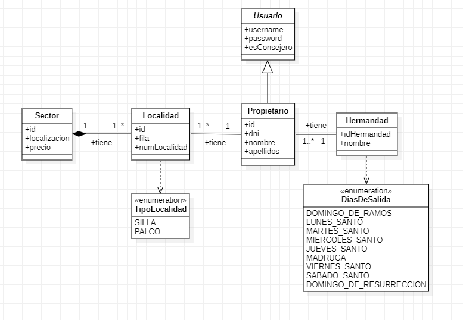

<h1>Gestion de localidades</h1>

En este repositorio encontrareis mi proyecto final de 1º curso del CFGS de DAM. El proyecto trata de la aplicacion que gestiona las ventas de localidades del Consejo General de Hermandades y Cofradias de la Ciudad de Sevilla en Semana Santa

Esta aplicacion sirve para llevar una mejor gestion de todas las hermandades, y todo lo que rodea a la carrera oficial de la Semana Santa de Sevilla.

<h2>Uso</h2>

Debido a que esta aplicacion esta pensada para un uso privado ya que solo podran acceder a ellas las personas dadas de alta por algun miembro del Consejo General de Hermandades y Cofradías de Sevilla.
 
Para una experiencia más dinamica se han añadido 100 propietarios para que se pueda testear la aplicaion con ellos, los cuales puedes iniciar sesion en la aplicaion con 2 de ellos que son los siguientes:
 
<h3>Administrador (Consejero):</h3>
 
Usuario: admin
Contraseña: admin
 
 
<h3>Usuario:</h3>
 
Usuario: user
Contraseña: 1234

<h2>Diseño</h2>
 
Para que os hagais con una primera idea podeis echar un vistazo al diagrama de clases UML del proyecto.
 

 
 
<h2>Funcionalidades</h2>
 
La aplicacion tiene diversas funcionalidades, pero no todas pueden ser usadas por todo el mundo. A continuacion vereis las funcionalidades que puede hacer cada rol.
 
<h3>Usuario</h3>
 
Como la idea principal de esta aplicacion es que se asemeje lo maximo posible a la realidad, esto ha causado un gran efecto negativo sobre el rol de usuario ya que este se ve muy limitado de funciones
 
<ul>
    <li>Solicitar una localidad</li>
    <li>Ver sus localidades</li>
    <li>Dar de baja sus localidades</li>
    <li>Editar su perfil (Nombre, apellidos y hermandad)</li>
</ul>
 
Se ha quedado pendiente de realizar las siguientes funciones del rol de usuario
 
<ul>
    <li>Vista dinamica de localidades</li>
    <li>Pagar localidades</li>
    <li>Cambiar usuario y contraseña</li>
</ul>
 
<h3>Administrador</h3>
 
El rol de administrado es el que puede disfrutar al maximo de todas las posibilidades que ofrece la aplicacion, las cuales son las siguientes.
 
<ul>
    <li>Solicitar una localidad</li>
    <li>Ver sus localidades</li>
    <li>Dar de baja sus localidades</li>
    <li>Crear, editar y borrar sectores</li>
    <li>Dar de alta, editar y borrar todos los datos de los propietarios</li>
    <li>Crear, editar y borrar hermandades</li>
    <li>Asignar localidades a cualquier propietario</li>
    <li>Editar su perfil</li>
</ul>
 
Se ha quedado pendiente de realizar las siguientes funciones del rol de administrador
 
<ul>
    <li>Enviar e-mails a los propietarios</li>
    <li>Generar facturas</li>
</ul>
